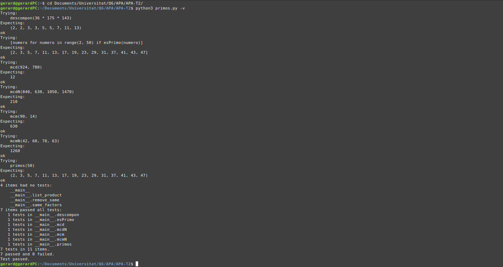

# Segunda tarea de APA 2023: Manejo de números primos

## Nom i cognoms Joel Joan Morera i Gerard Cots

## Fichero `primos.py`

- El alumno debe escribir el fichero `primos.py` que incorporará distintas funciones relacionadas con el manejo
  de los números primos.

- El fichero debe incluir una cadena de documentación que incluirá el nombre del alumno y los tests unitarios
  de las funciones incluidas.

- Cada función deberá incluir su propia cadena de documentación que indicará el cometido de la función, los
  argumentos de la misma y la salida proporcionada.

- Se valorará lo pythónico de la solución; en concreto, su claridad y sencillez, y el uso de los estándares marcados
  por PEP-8. También se valorará su eficiencia computacional.

### Determinación de la *primalidad* y descomposición de un número en factores primos

Incluya en el fichero `primos.py` las tres funciones siguientes:

- `esPrimo(numero)`   Devuelve `True` si su argumento es primo, y `False` si no lo es.
- `primos(numero)`    Devuelve una **tupla** con todos los números primos menores que su argumento.
- `descompon(numero)` Devuelve una **tupla** con la descomposición en factores primos de su argumento.

### Obtención del mínimo común múltiplo y el máximo común divisor

Usando las tres funciones del apartado anterior (y cualquier otra que considere conveniente añadir), escriba otras
dos que calculen el máximo común divisor y el mínimo común múltiplo de sus argumentos:

- `mcm(numero1, numero2)`:  Devuelve el mínimo común múltiplo de sus argumentos.
- `mcd(numero1, numero2)`:  Devuelve el máximo común divisor de sus argumentos.

Estas dos funciones deben cumplir las condiciones siguientes:

- Aunque se trate de una solución sub-óptima, en ambos casos deberá partirse de la descomposición en factores
  primos de los argumentos usando las funciones del apartado anterior.

- Aunque también sea sub-óptimo desde el punto de vista de la programación, ninguna de las dos funciones puede
  depender de la otra; cada una debe programarse por separado.

### Obtención del mínimo común múltiplo y el máximo común divisor para un número arbitrario de argumentos

Escriba las funciones `mcmN()` y `mcdN()`, que calculan el mínimo común múltiplo y el máximo común divisor para un
número arbitrario de argumentos:

- `mcm(*numeros)`:  Devuelve el mínimo común múltiplo de sus argumentos.
- `mcd(*numeros)`:  Devuelve el máximo común divisor de sus argumentos.

### Tests unitarios

La cadena de documentación del fichero debe incluir los tests unitarios de las cinco funciones. En concreto, deberán
comprobarse las siguientes condiciones:

- `esPrimo(numero)`:  Al ejecutar `[ numero for numero in range(2, 50) if esPrimo(numero) ]`, la salida debe ser
                      `[2, 3, 5, 7, 11, 13, 17, 19, 23, 29, 31, 37, 41, 43, 47]`.
- `primos(numeor)`: Al ejecutar `primos(50)`, la salida debe ser `(2, 3, 5, 7, 11, 13, 17, 19, 23, 29, 31, 37, 41, 43, 47)`.
- `descompon(numero)`: Al ejecutar `descompon(36 * 175 * 143)`, la salida debe ser `(2, 2, 3, 3, 5, 5, 7, 11, 13)`.
- `mcm(num1, num2)`: Al ejecutar `mcm(90, 14)`, la salida debe ser `630`.
- `mcd(num1, num2)`: Al ejecutar `mcd(924, 780)`, la salida debe ser `12`.
- `mcmN(numeros)`: Al ejecutar `mcm(42, 60, 70, 63)`, la salida debe ser `1260`.
- `mcdN(numeros)`: Al ejecutar `mcd(840, 630, 1050, 1470)`, la salida debe ser `210`.

### Entrega

#### Ejecución de los tests unitarios

Inserte a continuación una captura de pantalla que muestre el resultado de ejecutar el fichero `primos.py` con la opción
*verbosa*, de manera que se muestre el resultado de la ejecución de los tests unitarios.



#### Código desarrollado

Inserte a continuación el contenido del fichero `primos.py` usando los comandos necesarios para que se realice el
realce sintáctico en Python del mismo.

```python
"""
Joel Joan Morera | Gerard Cots
"""


def esPrimo(numero) -> bool:
    """
    Funció que retorna True si un número és primer 
    i False si no ho és.

    >>> [numero for numero in range(2, 50) if esPrimo(numero)]
    [2, 3, 5, 7, 11, 13, 17, 19, 23, 29, 31, 37, 41, 43, 47]

    """
    if numero <= 1:
        return False
    for value in range(2, int(numero**0.5) + 1):
        if numero % value == 0:
            return False
    return True
    

def primos(numero) -> tuple:
    """
    Retorna una tupla amb tots els nombres primers que es troben
    entre el 0 i el nombre escollit.

    >>> primos(50)
    (2, 3, 5, 7, 11, 13, 17, 19, 23, 29, 31, 37, 41, 43, 47)
    """
    return tuple(num for num in range(2, numero) if esPrimo(num))


def descompon(numero) -> tuple:
    """
    Retorna una tupla amb els factors primers del numero escollit.

    >>> descompon(36 * 175 * 143)
    (2, 2, 3, 3, 5, 5, 7, 11, 13)
    """
    tuple_ = []
    for valor in primos(numero):
        while numero % valor == 0:
            tuple_.append(valor)
            numero //= valor
    return tuple(tuple_)


def list_product(llista) -> int:
    """
    Retorna el producte de tots els elements d'una llista
    """
    producto = 1
    for factor in llista:
        producto *= factor
    return producto


def remove_same(llista1, llista2) -> list:
    """
    Retorna la llista2 sense els elements ja continguts a la llista1.
    """
    for factor in llista1:
        if factor in llista2:
            llista2.remove(factor)
    return llista2 


def same_factors(llista1, llista2) -> list:
    """
    Retorna una llista amb els elements que aparèixen tant a la llita1
    com a la llista2.
    """
    factores_comunes = []
    for factor in llista1:
        if factor in llista2:
            factores_comunes.append(factor)
            llista2.remove(factor)
    return factores_comunes


def mcm(numero1, numero2) -> int:
    """
    Retorna el mínin comú múltiple dels números 1 i 2.

    >>> mcm(90, 14)
    630
    """
    factores_primos_num1 = list(descompon(numero1))
    factores_primos_num2 = list(descompon(numero2))
  
    factores_mcm = (factores_primos_num1 
                    + remove_same(factores_primos_num1, factores_primos_num2))
    return list_product(factores_mcm)


def mcd(numero1, numero2) -> int:
    """
    Retorna el màxim comú divisor dels números 1 i 2.

    >>> mcd(924, 780)
    12
    """
    factores_primos_num1 = list(descompon(numero1))
    factores_primos_num2 = list(descompon(numero2))
    return list_product(same_factors(factores_primos_num1, 
                                     factores_primos_num2))


def mcmN(*argumentos) -> int:
    """
    Retorna el mínim comú múltiple dels arguments donats.

    >>> mcmN(42, 60, 70, 63)
    1260
    """
    factores_mcm = []
    for num in argumentos:
        factores_mcm += remove_same(factores_mcm, list(descompon(num)))

    return list_product(factores_mcm)


def mcdN(*argumentos) -> int:
    """
    Retorna el màxim comú divisor dels arguments donats.

    >>> mcdN(840, 630, 1050, 1470)
    210
    """
    factores_mcd = list(descompon(argumentos[0]))
    for num in argumentos:
        factores_num = list(descompon(num))
        factores_mcd = same_factors(factores_mcd, factores_num)
    
    return list_product(factores_mcd)

if __name__ == "__main__":
    import doctest
    doctest.testmod()
```

#### Subida del resultado al repositorio GitHub ¿y *pull-request*?

El fichero `primos.py`, la imagen con la ejecución de los tests unitarios y este mismo fichero, `README.md`, deberán
subirse al repositorio GitHub mediante la orden `git push`. Si los profesores de la asignatura consiguen montar el
sistema a tiempo, la entrega se formalizará realizando un *pull-request* al propietario del repositorio original.

El fichero `README.md` deberá respetar las reglas de los ficheros Markdown y visualizarse correctamente en el repositorio,
incluyendo la imagen con la ejecución de los tests unitarios y el realce sintáctico del código fuente insertado.
