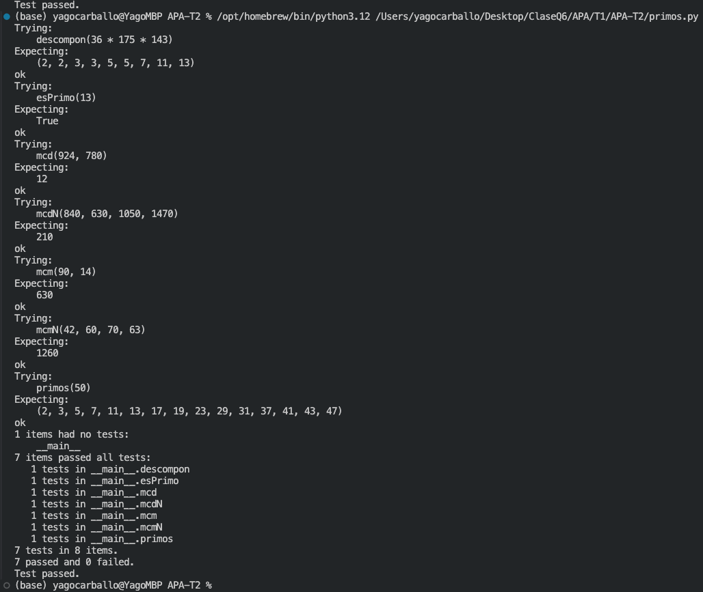

# Segunda tarea de APA 2023: Manejo de números primos

## Nom i cognoms: Yago Carballo Barroso

## Fichero `primos.py`

- El alumno debe escribir el fichero `primos.py` que incorporará distintas funciones relacionadas con el manejo
  de los números primos.

- El fichero debe incluir una cadena de documentación que incluirá el nombre del alumno y los tests unitarios
  de las funciones incluidas.

- Cada función deberá incluir su propia cadena de documentación que indicará el cometido de la función, los
  argumentos de la misma y la salida proporcionada.

- Se valorará lo pythónico de la solución; en concreto, su claridad y sencillez, y el uso de los estándares marcados
  por PEP-8. También se valorará su eficiencia computacional.

### Determinación de la *primalidad* y descomposición de un número en factores primos

Incluya en el fichero `primos.py` las tres funciones siguientes:

- `esPrimo(numero)`   Devuelve `True` si su argumento es primo, y `False` si no lo es.
- `primos(numero)`    Devuelve una **tupla** con todos los números primos menores que su argumento.
- `descompon(numero)` Devuelve una **tupla** con la descomposición en factores primos de su argumento.

### Obtención del mínimo común múltiplo y el máximo común divisor

Usando las tres funciones del apartado anterior (y cualquier otra que considere conveniente añadir), escriba otras
dos que calculen el máximo común divisor y el mínimo común múltiplo de sus argumentos:

- `mcm(numero1, numero2)`:  Devuelve el mínimo común múltiplo de sus argumentos.
- `mcd(numero1, numero2)`:  Devuelve el máximo común divisor de sus argumentos.

Estas dos funciones deben cumplir las condiciones siguientes:

- Aunque se trate de una solución sub-óptima, en ambos casos deberá partirse de la descomposición en factores
  primos de los argumentos usando las funciones del apartado anterior.

- Aunque también sea sub-óptimo desde el punto de vista de la programación, ninguna de las dos funciones puede
  depender de la otra; cada una debe programarse por separado.

### Obtención del mínimo común múltiplo y el máximo común divisor para un número arbitrario de argumentos

Escriba las funciones `mcmN()` y `mcdN()`, que calculan el mínimo común múltiplo y el máximo común divisor para un
número arbitrario de argumentos:

- `mcm(*numeros)`:  Devuelve el mínimo común múltiplo de sus argumentos.
- `mcd(*numeros)`:  Devuelve el máximo común divisor de sus argumentos.

### Tests unitarios

La cadena de documentación del fichero debe incluir los tests unitarios de las cinco funciones. En concreto, deberán
comprobarse las siguientes condiciones:

- `esPrimo(numero)`:  Al ejecutar `[ numero for numero in range(2, 50) if esPrimo(numero) ]`, la salida debe ser
                      `[2, 3, 5, 7, 11, 13, 17, 19, 23, 29, 31, 37, 41, 43, 47]`.
- `primos(numeor)`: Al ejecutar `primos(50)`, la salida debe ser `(2, 3, 5, 7, 11, 13, 17, 19, 23, 29, 31, 37, 41, 43, 47)`.
- `descompon(numero)`: Al ejecutar `descompon(36 * 175 * 143)`, la salida debe ser `(2, 2, 3, 3, 5, 5, 7, 11, 13)`.
- `mcm(num1, num2)`: Al ejecutar `mcm(90, 14)`, la salida debe ser `630`.
- `mcd(num1, num2)`: Al ejecutar `mcd(924, 780)`, la salida debe ser `12`.
- `mcmN(numeros)`: Al ejecutar `mcm(42, 60, 70, 63)`, la salida debe ser `1260`.
- `mcdN(numeros)`: Al ejecutar `mcd(840, 630, 1050, 1470)`, la salida debe ser `210`.

### Entrega

#### Ejecución de los tests unitarios

Inserte a continuación una captura de pantalla que muestre el resultado de ejecutar el fichero `primos.py` con la opción
*verbosa*, de manera que se muestre el resultado de la ejecución de los tests unitarios.



#### Código desarrollado

Inserte a continuación el contenido del fichero `primos.py` usando los comandos necesarios para que se realice el realce sintáctico en Python del mismo.

```python 
"""
  Determinación de la primalidad y mínimo común múltiplo y máximo común divisor
"""

def esPrimo(numero):
    """
    Devuelve True si su argumento es primo, y False si no lo es.
    >>> esPrimo(13)
    True
    """
    if numero <= 1: 
        return False

    for i in range(2,int(numero**0.5) + 1):
        if numero%i == 0:
            return False
    return True

def primos(numero):
    """
    Devuelve una tupla con todos los números primos menores que su argumento.
    >>> primos(50)
    (2, 3, 5, 7, 11, 13, 17, 19, 23, 29, 31, 37, 41, 43, 47)
    """
    
    if numero <= 1: 
        return False
    
    return tuple([i for i in range(2,numero) if esPrimo(i)])


def descompon(numero):
    """
    Devuelve una tupla con la descomposición en factores primos de su argumento.  
    >>> descompon(36 * 175 * 143)
    (2, 2, 3, 3, 5, 5, 7, 11, 13)
    """

    if esPrimo(numero):
        return (numero, )

    lista = []
    for i in primos(numero):
        while numero % i == 0:
            lista.append(i)
            numero /= i
            
    return tuple(lista)

def mcm(numero1, numero2):
    """
    Devuelve el mínimo común múltiplo de sus argumentos.
    >>> mcm(90, 14)
    630
    """
    if numero1 <= 1 or esPrimo(numero1):
        if numero1 in descompon(numero2):
            return numero2
        else:
            return numero1*numero2
        
    if numero2 <= 1 or esPrimo(numero2):
        if numero2 in descompon(numero1):
            return numero1
        else:
            return numero1*numero2
        
    exponentes1 = {}
    exponentes2 = {}

    for i in descompon(numero1):
        if i in exponentes1:
            exponentes1[i] += 1
        else:
            exponentes1[i] = 1

    for i in descompon(numero2):
        if i in exponentes2:
            exponentes2[i] += 1
        else:
            exponentes2[i] = 1

    tot = 1

    for k in exponentes1:
        if k in exponentes2:
            if exponentes1[k] > exponentes2[k]:
                tot *= k**exponentes1[k]
            else:
                tot *= k**exponentes2[k]
        else:
            tot *= k**exponentes1[k]

    for k in exponentes2:
        if k not in exponentes1:
            tot *= k**exponentes2[k]

    return tot


def mcd(numero1, numero2): 
    """
    Devuelve el máximo común divisor de sus argumentos.
    >>> mcd(924, 780)
    12
    """
    componentes1 = {}
    componentes2 = {}

    for key in descompon(numero1):
        if key in componentes1:
            componentes1[key] += 1
        else:
            componentes1[key] = 1

    for key in descompon(numero2):
        if key in componentes2:
            componentes2[key] += 1
        else:
            componentes2[key] = 1
    
    tot = 1

    for key in componentes1:
        if key in componentes2:
            if componentes1[key] < componentes2[key]:
                tot *= key**componentes1[key]
            else:
                tot *= key**componentes2[key]

    return tot

def mcmN(*numeros):
    """
    Devuelve el mínimo común múltiplo de sus argumentos.
    >>> mcmN(42, 60, 70, 63)
    1260
    """
    acumulado = numeros[0]

    for numero in numeros[1:]:
        acumulado = mcm(acumulado,numero)

    return acumulado

def mcdN(*numeros): 
    """
    Devuelve el máximo común divisor de sus argumentos.
    >>> mcdN(840, 630, 1050, 1470)
    210
    """
    acumulado = numeros[0]

    for numero in numeros[1:]:
        acumulado = mcd(acumulado,numero)

    return acumulado

if __name__ == "__main__":
    import doctest
    doctest.testmod(verbose=True)
```

#### Subida del resultado al repositorio GitHub ¿y *pull-request*?

El fichero `primos.py`, la imagen con la ejecución de los tests unitarios y este mismo fichero, `README.md`, deberán
subirse al repositorio GitHub mediante la orden `git push`. Si los profesores de la asignatura consiguen montar el
sistema a tiempo, la entrega se formalizará realizando un *pull-request* al propietario del repositorio original.

El fichero `README.md` deberá respetar las reglas de los ficheros Markdown y visualizarse correctamente en el repositorio,
incluyendo la imagen con la ejecución de los tests unitarios y el realce sintáctico del código fuente insertado.
