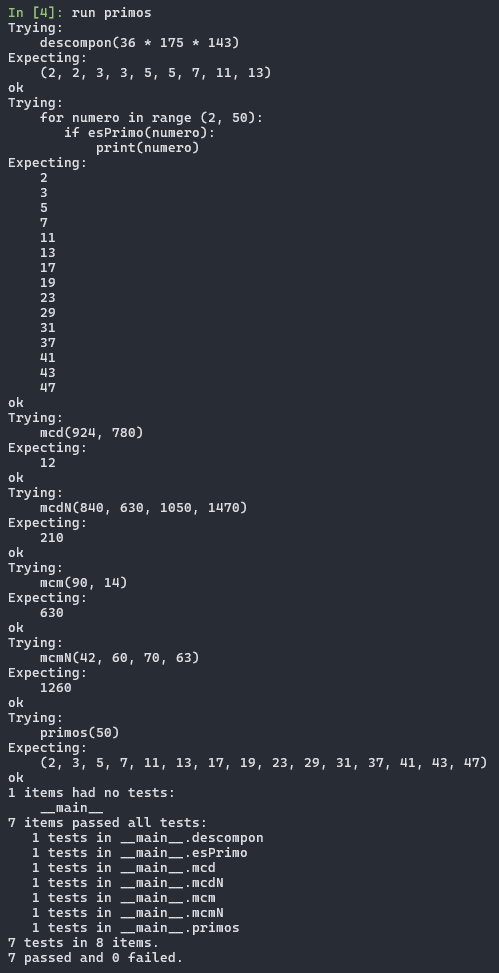

# Segunda tarea de APA 2023: Manejo de números primos

## Nom i cognoms

## Fichero `primos.py`

- El alumno debe escribir el fichero `primos.py` que incorporará distintas funciones relacionadas con el manejo
  de los números primos.

- El fichero debe incluir una cadena de documentación que incluirá el nombre del alumno y los tests unitarios
  de las funciones incluidas.

- Cada función deberá incluir su propia cadena de documentación que indicará el cometido de la función, los
  argumentos de la misma y la salida proporcionada.

- Se valorará lo pythónico de la solución; en concreto, su claridad y sencillez, y el uso de los estándares marcados
  por PEP-8. También se valorará su eficiencia computacional.

### Determinación de la *primalidad* y descomposición de un número en factores primos

Incluya en el fichero `primos.py` las tres funciones siguientes:

- `esPrimo(numero)`   Devuelve `True` si su argumento es primo, y `False` si no lo es.
- `primos(numero)`    Devuelve una **tupla** con todos los números primos menores que su argumento.
- `descompon(numero)` Devuelve una **tupla** con la descomposición en factores primos de su argumento.

### Obtención del mínimo común múltiplo y el máximo común divisor

Usando las tres funciones del apartado anterior (y cualquier otra que considere conveniente añadir), escriba otras
dos que calculen el máximo común divisor y el mínimo común múltiplo de sus argumentos:

- `mcm(numero1, numero2)`:  Devuelve el mínimo común múltiplo de sus argumentos.
- `mcd(numero1, numero2)`:  Devuelve el máximo común divisor de sus argumentos.

Estas dos funciones deben cumplir las condiciones siguientes:

- Aunque se trate de una solución sub-óptima, en ambos casos deberá partirse de la descomposición en factores
  primos de los argumentos usando las funciones del apartado anterior.

- Aunque también sea sub-óptimo desde el punto de vista de la programación, ninguna de las dos funciones puede
  depender de la otra; cada una debe programarse por separado.

### Obtención del mínimo común múltiplo y el máximo común divisor para un número arbitrario de argumentos

Escriba las funciones `mcmN()` y `mcdN()`, que calculan el mínimo común múltiplo y el máximo común divisor para un
número arbitrario de argumentos:

- `mcm(*numeros)`:  Devuelve el mínimo común múltiplo de sus argumentos.
- `mcd(*numeros)`:  Devuelve el máximo común divisor de sus argumentos.

### Tests unitarios

La cadena de documentación del fichero debe incluir los tests unitarios de las cinco funciones. En concreto, deberán
comprobarse las siguientes condiciones:

- `esPrimo(numero)`:  Al ejecutar `[ numero for numero in range(2, 50) if esPrimo(numero) ]`, la salida debe ser
                      `[2, 3, 5, 7, 11, 13, 17, 19, 23, 29, 31, 37, 41, 43, 47]`.
- `primos(numeor)`: Al ejecutar `primos(50)`, la salida debe ser `(2, 3, 5, 7, 11, 13, 17, 19, 23, 29, 31, 37, 41, 43, 47)`.
- `descompon(numero)`: Al ejecutar `descompon(36 * 175 * 143)`, la salida debe ser `(2, 2, 3, 3, 5, 5, 7, 11, 13)`.
- `mcm(num1, num2)`: Al ejecutar `mcm(90, 14)`, la salida debe ser `630`.
- `mcd(num1, num2)`: Al ejecutar `mcd(924, 780)`, la salida debe ser `12`.
- `mcmN(numeros)`: Al ejecutar `mcm(42, 60, 70, 63)`, la salida debe ser `1260`.
- `mcdN(numeros)`: Al ejecutar `mcd(840, 630, 1050, 1470)`, la salida debe ser `210`.

### Entrega

#### Ejecución de los tests unitarios

Inserte a continuación una captura de pantalla que muestre el resultado de ejecutar el fichero `primos.py` con la opción
*verbosa*, de manera que se muestre el resultado de la ejecución de los tests unitarios.


#### Código desarrollado

Inserte a continuación el contenido del fichero `primos.py` usando los comandos necesarios para que se realice el
realce sintáctico en Python del mismo.

```python
def esPrimo(numero):
    
    """
    devuelve True si el numero es primo y False si no lo es
    
    >>> for numero in range (2, 50):
    ...    if esPrimo(numero):
    ...        print(numero)
    2
    3
    5
    7
    11
    13
    17
    19
    23
    29
    31
    37
    41
    43
    47
    """
    for prueba in range (2, numero):
        if numero % prueba == 0:
            return False
    else: return True   

def primos(numero):
    
    """
    devuelve una tupla con todos los numeros primos menores
    
    >>> primos(50)
    (2, 3, 5, 7, 11, 13, 17, 19, 23, 29, 31, 37, 41, 43, 47)
    """ 
    return tuple(prueba for prueba in range(2, numero) if esPrimo(prueba))

def descompon(numero):                          #Devuelve una tupla con la descomposición en factores primos de su argumento.
    
    """
    Devuelve una tupla con la descomposición en factores primos de su argumento.
    
    >>> descompon(36 * 175 * 143)
    (2, 2, 3, 3, 5, 5, 7, 11, 13)
    """
    factores_primos = []                        #crea una llista buida
    divisor = 2                                 #divizor iinicialitzat a 2 
    while numero > 1:                           #mentre numero sigui mes gran que 1
        if numero % divisor == 0:               #si el residu de la divisio de numero i divisor es 0
            factores_primos.append(divisor)     #afegeix divisor a la llista
            numero = numero / divisor           #numero es igual a la divisio de numero i divisor 
        else:
            divisor += 1                        #si no es compleix la condicio anterior incrementa el divisor en 1
    return tuple(factores_primos)               #retorna la llista passada a tupla amb els factors primers

def mcm(numero1, numero2):
    """
    Devuelve el mínimo común múltiplo de dos números enteros.
    
    Hem utilitzat el metode de descomposició en factors primers per aconseguir el mcm de dos numeros enters.
    
    >>> mcm(90, 14)
    630
    """
    factores_primos1 = descompon(numero1) #
    factores_primos2 = descompon(numero2)
    factores_comunes = []
    factores_no_comunes = []
    mcm = 1
    
    factores_comunes = list(set(factores_primos1) & set(factores_primos2)) #trobem els factors comuns no repetits (gracies el set que borra repetits)
    factores_no_comunes = list(set(factores_primos1) ^ set(factores_primos2)) #trobem els factors no comuns no repetits (gracies el set que borra repetits)
    
    # a continuació recorrem els factors comuns i comptem quants cops es repeteixen en cada llista de factors primers, el que és repeteixi més vegades es multiplica al mcm
            
    for factor in factores_comunes:
        mcm *= factor ** max(factores_primos1.count(factor), factores_primos2.count(factor))
    
    #ara recorrem els factors no comuns i els multipliquem al mcm elevats al nombre de vegades que es repeteixen 
            
    for factor in  factores_no_comunes:
        if factor in factores_primos1:
            mcm *= factor ** factores_primos1.count(factor)
        else: 
            mcm *= factor ** factores_primos2.count(factor)       
    return mcm

def mcd(numero1, numero2):
    """
    Devuelve el máximo común divisor de dos números enteros.
    
    Utiliza la descomposición en factores primos para obtener el mcd de dos números enteros.
        
    >>> mcd(924, 780)
    12
    """
    factores_primos1 = descompon(numero1)
    factores_primos2 = descompon(numero2)
    factores_comunes = list(set(factores_primos1) & set(factores_primos2))
    mcd = 1
        
    for factor in factores_comunes:
        mcd *= factor ** min(factores_primos1.count(factor), factores_primos2.count(factor))
        
    return mcd

def mcmN(*numeros):
    """
    Devuelve el mínimo común múltiplo de un numero arbitrario de numeros. 
    
    >>> mcmN(42, 60, 70, 63)
    1260
    """
    mcm_total = 1
    for numero in numeros:
        mcm_total = mcm(mcm_total, numero) #encontramos el mcm comun de todos los numeros
    return mcm_total

def mcdN(*numeros):
    """
    Devuelve el máximo común divisor de un numero arbitrario de numeros. 
    
    >>> mcdN(840, 630, 1050, 1470)
    210
    """
    mcd_total = numeros[0] #inicializamos el mcd_total al primer numero de la lista de numeros passados a la funcion 
    for numero in numeros:
        mcd_total = mcd(mcd_total, numero) #encontramos el mcd comun de todos los numeros
    return mcd_total

if __name__ == "__main__":
    import doctest
    doctest.testmod(verbose=True)
```   
  

#### Subida del resultado al repositorio GitHub ¿y *pull-request*?

El fichero `primos.py`, la imagen con la ejecución de los tests unitarios y este mismo fichero, `README.md`, deberán
subirse al repositorio GitHub mediante la orden `git push`. Si los profesores de la asignatura consiguen montar el
sistema a tiempo, la entrega se formalizará realizando un *pull-request* al propietario del repositorio original.

El fichero `README.md` deberá respetar las reglas de los ficheros Markdown y visualizarse correctamente en el repositorio,
incluyendo la imagen con la ejecución de los tests unitarios y el realce sintáctico del código fuente insertado.
