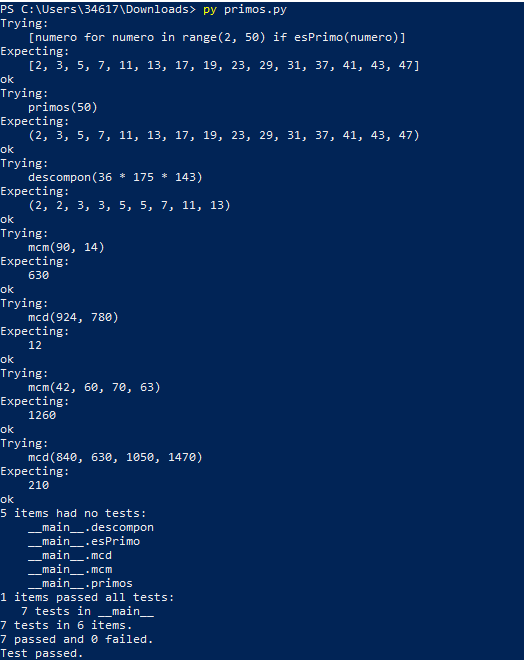

# Segunda tarea de APA 2026: Manejo de números primos

> [!Caution]
>
> El objetivo de esta tarea es manejar los tipos de datos y las estructuras de control de flujo de
> Python. Existen bibliotecas que resuelven los apartados del enunciado de una manera más eficiente
> y, sin duda, más sencilla, pero su uso está prohibido.
>
> Además, se valorará también el uso de Markdown en la redacción del fichero README.md; en concreto,
> la inclusión de código fuente con las herramientas propias de Markdown para su realce sintáctico, y
> la inclusión de imágenes con las capturas de pantalla solicitadas. El fichero README.md deberá ser
> visualizado correctamente desde la página principal del repositorio GitHub del alumno sin ninguna
> intervención por parte del profesor.
>
> Dispone del fichero MARKDOWN.md con información básica para el uso de Markdown, así como con enlaces
> a la documentación oficial del mismo.
>
> ¿Quiere saber más?, consulte con el profesorado.
  
## Nom i cognoms

> [!Important]
> Introduzca a continuación su nombre y apellidos:
>
> Álvaro Ramo Irurre

## Fichero `primos.py`

- El alumno debe escribir el fichero `primos.py` que incorporará distintas funciones relacionadas con el manejo
  de los números primos.

- El fichero debe incluir una cadena de documentación que incluirá el nombre del alumno y los tests unitarios
  de las funciones incluidas.

- Cada función deberá incluir su propia cadena de documentación que indicará el cometido de la función, los
  argumentos de la misma y la salida proporcionada.

- Se valorará lo pythónico de la solución; en concreto, su claridad y sencillez, y el uso de los estándares marcados
  por PEP-8. También se valorará su eficiencia computacional.

### Determinación de la *primalidad* y descomposición de un número en factores primos

Incluya en el fichero `primos.py` las tres funciones siguientes:

- `esPrimo(numero)`   Devuelve `True` si su argumento es primo, y `False` si no lo es.
  - Se debe considerar que `numero` es un número natural y mayor que uno.
  - En caso contrario, la función debe elevar la excepción `TypeError` y finalizar la ejecución.
- `primos(numero)`    Devuelve una **tupla** con todos los números primos menores que su argumento.
- `descompon(numero)` Devuelve una **tupla** con la descomposición en factores primos de su argumento.

### Obtención del mínimo común múltiplo y el máximo común divisor

Usando las tres funciones del apartado anterior (y cualquier otra que considere conveniente añadir), escriba otras
dos que calculen el máximo común divisor y el mínimo común múltiplo de sus argumentos:

- `mcm(numero1, numero2)`:  Devuelve el mínimo común múltiplo de sus argumentos.
- `mcd(numero1, numero2)`:  Devuelve el máximo común divisor de sus argumentos.

Estas dos funciones deben cumplir las condiciones siguientes:

- Aunque se trate de una solución sub-óptima, en ambos casos deberá partirse de la descomposición en factores
  primos de los argumentos usando las funciones del apartado anterior.

- Aunque también sea sub-óptimo desde el punto de vista de la programación, ninguna de las dos funciones puede
  depender de la otra; cada una debe programarse por separado.

### Obtención del mínimo común múltiplo y el máximo común divisor para un número arbitrario de argumentos

Modifique las funciones `mcm()` y `mcd()`, para que calculen el mínimo común múltiplo y el máximo común divisor
para un número arbitrario de argumentos:

- `mcm(*numeros)`:  Devuelve el mínimo común múltiplo de sus argumentos.
- `mcd(*numeros)`:  Devuelve el máximo común divisor de sus argumentos.

### Tests unitarios

La cadena de documentación del fichero debe incluir los tests unitarios de las cinco funciones. En concreto, deberán
comprobarse las siguientes condiciones:

- `esPrimo(numero)`:  Al ejecutar `[ numero for numero in range(2, 50) if esPrimo(numero) ]`, la salida debe ser
                      `[2, 3, 5, 7, 11, 13, 17, 19, 23, 29, 31, 37, 41, 43, 47]`.
- `primos(numeor)`: Al ejecutar `primos(50)`, la salida debe ser `(2, 3, 5, 7, 11, 13, 17, 19, 23, 29, 31, 37, 41, 43, 47)`.
- `descompon(numero)`: Al ejecutar `descompon(36 * 175 * 143)`, la salida debe ser `(2, 2, 3, 3, 5, 5, 7, 11, 13)`.
- `mcm(num1, num2)`: Al ejecutar `mcm(90, 14)`, la salida debe ser `630`.
- `mcd(num1, num2)`: Al ejecutar `mcd(924, 780)`, la salida debe ser `12`.
- `mcm(numeros)`: Al ejecutar `mcm(42, 60, 70, 63)`, la salida debe ser `1260`.
- `mcd(numeros)`: Al ejecutar `mcd(840, 630, 1050, 1470)`, la salida debe ser `210`.

### Entrega

#### Ejecución de los tests unitarios

Inserte a continuación una captura de pantalla que muestre el resultado de ejecutar el fichero `primos.py` con la opción
*verbosa*, de manera que se muestre el resultado de la ejecución de los tests unitarios.



#### Código desarrollado

Inserte a continuación el contenido del fichero `primos.py` usando los comandos necesarios para que se realice el
realce sintáctico en Python del mismo.

```python
"""
Manejo de números primos.

Nombre: Álvaro Ramo Irurre

>>> [numero for numero in range(2, 50) if esPrimo(numero)]
[2, 3, 5, 7, 11, 13, 17, 19, 23, 29, 31, 37, 41, 43, 47]

>>> primos(50)
(2, 3, 5, 7, 11, 13, 17, 19, 23, 29, 31, 37, 41, 43, 47)

>>> descompon(36 * 175 * 143)
(2, 2, 3, 3, 5, 5, 7, 11, 13)

>>> mcm(90, 14)
630

>>> mcd(924, 780)
12

>>> mcm(42, 60, 70, 63)
1260

>>> mcd(840, 630, 1050, 1470)
210
"""


def esPrimo(numero):
    """
    Devuelve True si numero es primo, False si no lo es.

    El argumento debe ser un número natural mayor que 1.
    En caso contrario, eleva TypeError.

    >>> esPrimo(2)
    True
    >>> esPrimo(9)
    False
    """
    if not isinstance(numero, int) or numero < 2:
        raise TypeError(f"{numero} no es un número natural mayor que 1")

    for divisor in range(2, int(numero**0.5) + 1):
        if numero % divisor == 0:
            return False
    return True


def primos(numero):
    """
    Devuelve una tupla con todos los números primos menores que numero.

    >>> primos(10)
    (2, 3, 5, 7)
    """
    return tuple(n for n in range(2, numero) if esPrimo(n))


def descompon(numero):
    """
    Devuelve una tupla con la descomposición en factores primos de numero.

    >>> descompon(12)
    (2, 2, 3)
    """
    factores = []
    divisor = 2
    while divisor * divisor <= numero:
        while numero % divisor == 0:
            factores.append(divisor)
            numero //= divisor
        divisor += 1
    if numero > 1:
        factores.append(numero)
    return tuple(factores)


def mcm(*numeros):
    """
    Devuelve el mínimo común múltiplo de sus argumentos.

    >>> mcm(4, 6)
    12
    """
    factores_mcm = {}
    for numero in numeros:
        factores = descompon(numero)
        conteo = {}
        for factor in factores:
            conteo[factor] = conteo.get(factor, 0) + 1
        for factor, exp in conteo.items():
            if factores_mcm.get(factor, 0) < exp:
                factores_mcm[factor] = exp

    resultado = 1
    for factor, exp in factores_mcm.items():
        resultado *= factor ** exp
    return resultado


def mcd(*numeros):
    """
    Devuelve el máximo común divisor de sus argumentos.

    >>> mcd(12, 8)
    4
    """
    factores_mcd = {}
    for i, numero in enumerate(numeros):
        factores = descompon(numero)
        conteo = {}
        for factor in factores:
            conteo[factor] = conteo.get(factor, 0) + 1

        if i == 0:
            factores_mcd = conteo
        else:
            factores_mcd = {
                factor: min(exp, conteo.get(factor, 0))
                for factor, exp in factores_mcd.items()
                if factor in conteo
            }

    resultado = 1
    for factor, exp in factores_mcd.items():
        resultado *= factor ** exp
    return resultado


if __name__ == "__main__":
    import doctest
    doctest.testmod(verbose=True)
```

#### Subida del resultado al repositorio GitHub ¿y *pull-request*?

El fichero `primos.py`, la imagen con la ejecución de los tests unitarios y este mismo fichero, `README.md`, deberán
subirse al repositorio GitHub mediante la orden `git push`. Si los profesores de la asignatura consiguen montar el
sistema a tiempo, la entrega se formalizará realizando un *pull-request* al propietario del repositorio original.

El fichero `README.md` deberá respetar las reglas de los ficheros Markdown y visualizarse correctamente en el repositorio,
incluyendo la imagen con la ejecución de los tests unitarios y el realce sintáctico del código fuente insertado.
