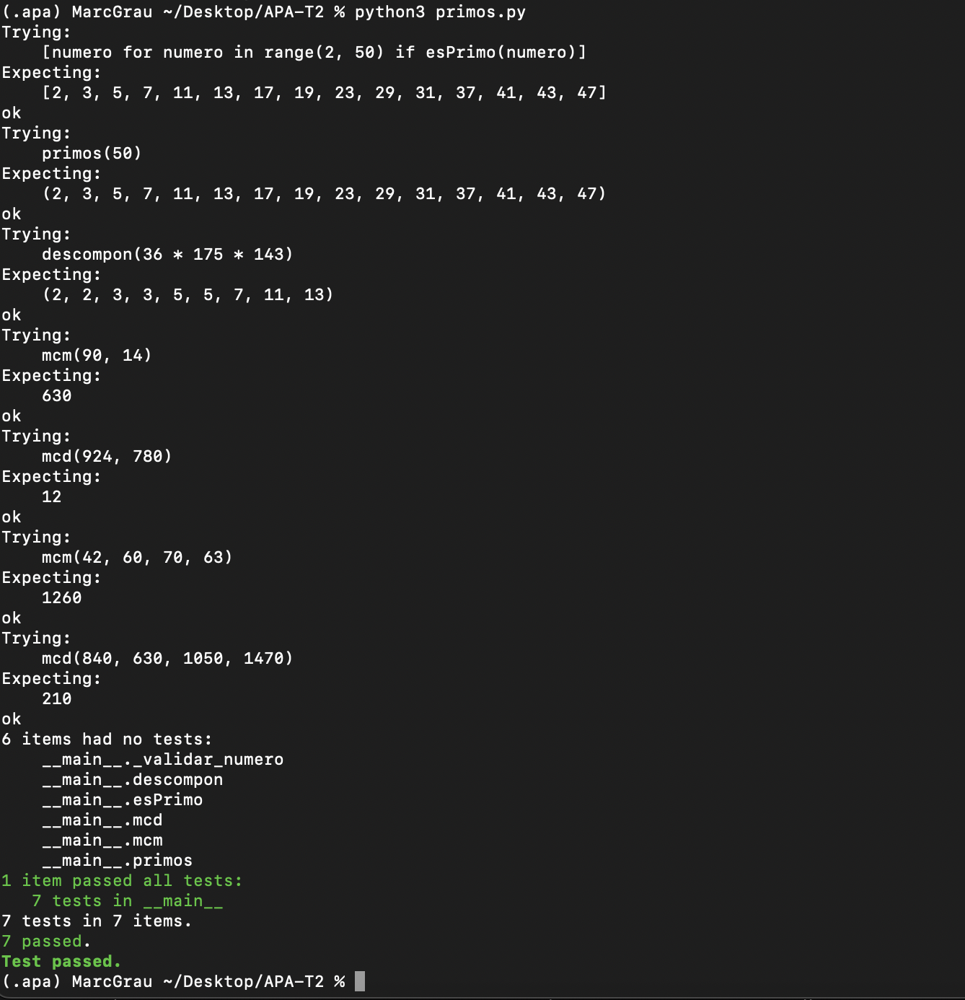
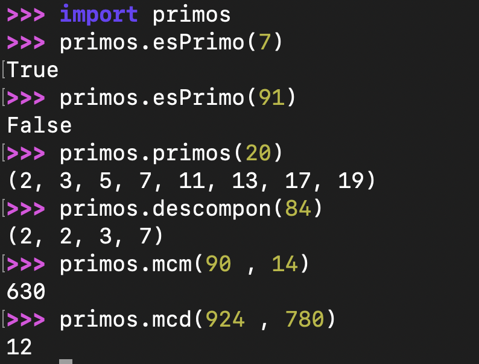

# Segunda entrega de APA: Manejo de números primos

**Alumno:** Marc Grau Casado

## Descripción de la práctica

En esta práctica se ha desarrollado el fichero `primos.py`, que implementa distintas funciones relacionadas con el manejo de números primos, siguiendo las restricciones indicadas en el enunciado y evitando el uso de bibliotecas externas que resuelvan directamente el problema.

Las funciones implementadas son las siguientes:

- `esPrimo(numero)`: determina si un número natural mayor que uno es primo.
- `primos(numero)`: devuelve una tupla con todos los números primos menores que el valor indicado.
- `descompon(numero)`: devuelve la descomposición en factores primos de un número.
- `mcm(*numeros)`: calcula el mínimo común múltiplo de un número arbitrario de argumentos.
- `mcd(*numeros)`: calcula el máximo común divisor de un número arbitrario de argumentos.

La implementación se ha realizado buscando claridad, sencillez y corrección, respetando un estilo de programación legible y próximo a las recomendaciones de PEP-8. Para el cálculo del `mcm` y del `mcd` se ha partido, tal como exige el enunciado, de la descomposición en factores primos de los argumentos.

## Entrega

### Ejecución de los tests unitarios

A continuación se inserta una captura de pantalla que muestra el resultado de ejecutar el fichero `primos.py` con la opción verbosa, de manera que se visualiza correctamente la ejecución de los tests unitarios incluidos en la cadena de documentación del módulo.





### Código desarrollado

A continuación se inserta el contenido del fichero `primos.py`, utilizando un bloque de código Markdown con realce sintáctico de Python.

```python
"""
Autor: Marc Grau Casado

Módulo primos: gestión de números primos.

Tests unitarios
===============

>>> [numero for numero in range(2, 50) if esPrimo(numero)]
[2, 3, 5, 7, 11, 13, 17, 19, 23, 29, 31, 37, 41, 43, 47]

>>> primos(50)
(2, 3, 5, 7, 11, 13, 17, 19, 23, 29, 31, 37, 41, 43, 47)

>>> descompon(36 * 175 * 143)
(2, 2, 3, 3, 5, 5, 7, 11, 13)

>>> mcm(90, 14)
630

>>> mcd(924, 780)
12

>>> mcm(42, 60, 70, 63)
1260

>>> mcd(840, 630, 1050, 1470)
210
"""

from collections import Counter
import doctest


def _validar_numero(numero):
    """
    Comprueba que el argumento sea un número natural mayor que uno.

    Args:
        numero (int): Valor a validar.

    Raises:
        TypeError: Si el argumento no es un entero mayor que uno.
    """
    if not isinstance(numero, int) or isinstance(numero, bool) or numero <= 1:
        raise TypeError("El argumento debe ser un número natural mayor que uno.")


def esPrimo(numero):
    """
    Devuelve True si su argumento es primo y False en caso contrario.

    Args:
        numero (int): Número natural mayor que uno.

    Returns:
        bool: True si el número es primo, False si no lo es.

    Raises:
        TypeError: Si el argumento no es un número natural mayor que uno.
    """
    _validar_numero(numero)

    if numero == 2:
        return True

    if numero % 2 == 0:
        return False

    divisor = 3
    while divisor * divisor <= numero:
        if numero % divisor == 0:
            return False
        divisor += 2

    return True


def primos(numero):
    """
    Devuelve una tupla con todos los números primos menores que su argumento.

    Args:
        numero (int): Número natural mayor que uno.

    Returns:
        tuple: Tupla con los números primos menores que numero.

    Raises:
        TypeError: Si el argumento no es un número natural mayor que uno.
    """
    _validar_numero(numero)
    return tuple(n for n in range(2, numero) if esPrimo(n))


def descompon(numero):
    """
    Devuelve una tupla con la descomposición en factores primos de su argumento.

    Args:
        numero (int): Número natural mayor que uno.

    Returns:
        tuple: Tupla con los factores primos de numero, ordenados de menor a mayor.

    Raises:
        TypeError: Si el argumento no es un número natural mayor que uno.
    """
    _validar_numero(numero)

    factores = []
    n = numero

    while n % 2 == 0:
        factores.append(2)
        n //= 2

    divisor = 3
    while divisor * divisor <= n:
        while n % divisor == 0:
            factores.append(divisor)
            n //= divisor
        divisor += 2

    if n > 1:
        factores.append(n)

    return tuple(factores)


def mcm(*numeros):
    """
    Devuelve el mínimo común múltiplo de un número arbitrario de argumentos.

    Args:
        *numeros (int): Números naturales mayores que uno.

    Returns:
        int: Mínimo común múltiplo de los argumentos.

    Raises:
        TypeError: Si no se proporcionan argumentos válidos.
    """
    if not numeros:
        raise TypeError("Debe proporcionarse al menos un número.")

    for numero in numeros:
        _validar_numero(numero)

    maximos = Counter()

    for numero in numeros:
        factores = Counter(descompon(numero))
        for primo, exponente in factores.items():
            if exponente > maximos[primo]:
                maximos[primo] = exponente

    resultado = 1
    for primo, exponente in maximos.items():
        resultado *= primo ** exponente

    return resultado


def mcd(*numeros):
    """
    Devuelve el máximo común divisor de un número arbitrario de argumentos.

    Args:
        *numeros (int): Números naturales mayores que uno.

    Returns:
        int: Máximo común divisor de los argumentos.

    Raises:
        TypeError: Si no se proporcionan argumentos válidos.
    """
    if not numeros:
        raise TypeError("Debe proporcionarse al menos un número.")

    for numero in numeros:
        _validar_numero(numero)

    comunes = Counter(descompon(numeros[0]))

    for numero in numeros[1:]:
        factores = Counter(descompon(numero))
        interseccion = Counter()
        for primo in comunes:
            if primo in factores:
                interseccion[primo] = min(comunes[primo], factores[primo])
        comunes = interseccion

    resultado = 1
    for primo, exponente in comunes.items():
        resultado *= primo ** exponente

    return resultado


if __name__ == "__main__":
    doctest.testmod(verbose=True)
```

## Subida del resultado al repositorio GitHub ¿y pull-request?

El fichero `primos.py`, la imagen con la ejecución de los tests unitarios y este mismo fichero `README.md` han sido incorporados al repositorio GitHub para su entrega y revisión.

El fichero `README.md` respeta la sintaxis de Markdown y se visualiza correctamente en el repositorio, incluyendo la imagen con la ejecución de los tests unitarios y el realce sintáctico del código fuente insertado.

