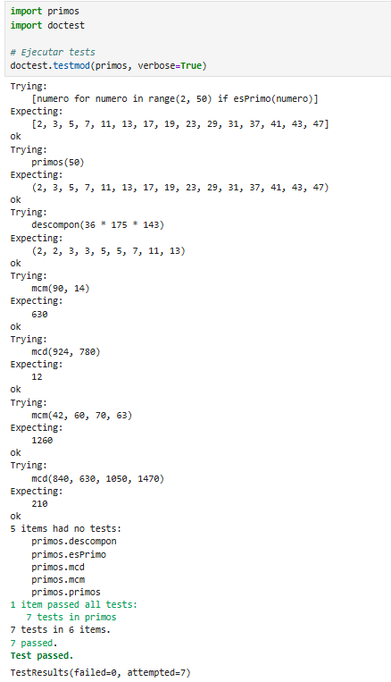

# Segunda tarea de APA 2026: Manejo de números primos

**Nombre:** Sandra Cots Agüera

## 📊 Ejecución de los tests unitarios
A continuación se muestra la captura de pantalla de la ejecución del fichero `primos.py` con la opción verbosa (`-v`), confirmando que todas las funciones pasan los tests requeridos:



## 💻 Código desarrollado
El código se ha realizado siguiendo las normas de estilo **PEP-8** y sin utilizar bibliotecas externas prohibidas.

```python
"""
Nombre del alumno: Sandra Cots Agüera
Tests unitarios:
>>> [numero for numero in range(2, 50) if esPrimo(numero)]
[2, 3, 5, 7, 11, 13, 17, 19, 23, 29, 31, 37, 41, 43, 47]

>>> primos(50)
(2, 3, 5, 7, 11, 13, 17, 19, 23, 29, 31, 37, 41, 43, 47)

>>> descompon(36 * 175 * 143)
(2, 2, 3, 3, 5, 5, 7, 11, 13)

>>> mcm(90, 14)
630

>>> mcd(924, 780)
12

>>> mcm(42, 60, 70, 63)
1260

>>> mcd(840, 630, 1050, 1470)
210
"""

def esPrimo(numero):
    """Devuelve True si el argumento es primo. Requiere un natural mayor que 1."""
    if not isinstance(numero, int) or numero <= 1:
        raise TypeError("El argumento debe ser un número natural mayor que 1.")
    for i in range(2, int(numero**0.5) + 1):
        if numero % i == 0:
            return False
    return True

def primos(numero):
    """Devuelve una tupla con todos los números primos menores que su argumento."""
    return tuple(n for n in range(2, numero) if esPrimo(n))

def descompon(numero):
    """Devuelve una tupla con la descomposición en factores primos de su argumento."""
    factores = []
    divisor = 2
    temp = numero
    while temp > 1:
        while temp % divisor == 0:
            factores.append(divisor)
            temp //= divisor
        divisor += 1
    return tuple(factores)

def mcd(*numeros):
    """Calcula el máximo común divisor para un número arbitrario de argumentos."""
    from collections import Counter
    if not numeros: return None
    
    # Descomponemos el primer número para comparar
    res_counts = Counter(descompon(numeros[0]))
    
    for n in numeros[1:]:
        counts = Counter(descompon(n))
        for factor in res_counts:
            res_counts[factor] = min(res_counts[factor], counts[factor])
            
    mcd_val = 1
    for factor, exponente in res_counts.items():
        mcd_val *= (factor ** exponente)
    return mcd_val

def mcm(*numeros):
    """Calcula el mínimo común múltiplo para un número arbitrario de argumentos."""
    from collections import Counter
    if not numeros: return None
    
    max_counts = Counter()
    for n in numeros:
        counts = Counter(descompon(n))
        for factor, exponente in counts.items():
            max_counts[factor] = max(max_counts[factor], exponente)
            
    mcm_val = 1
    for factor, exponente in max_counts.items():
        mcm_val *= (factor ** exponente)
    return mcm_val

if __name__ == "__main__":
    import doctest
    doctest.testmod(verbose=True)
