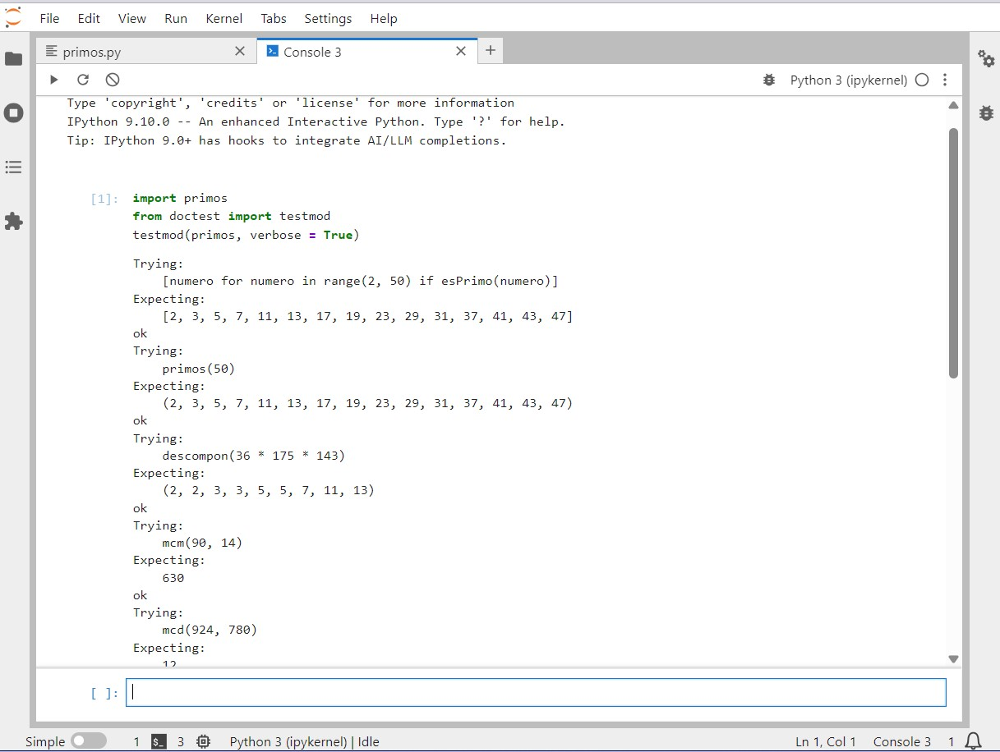
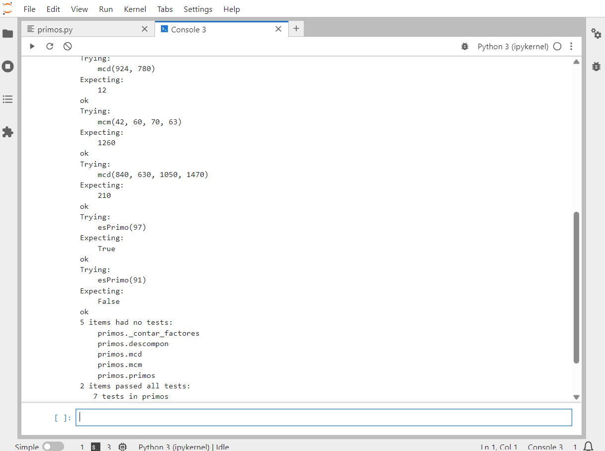
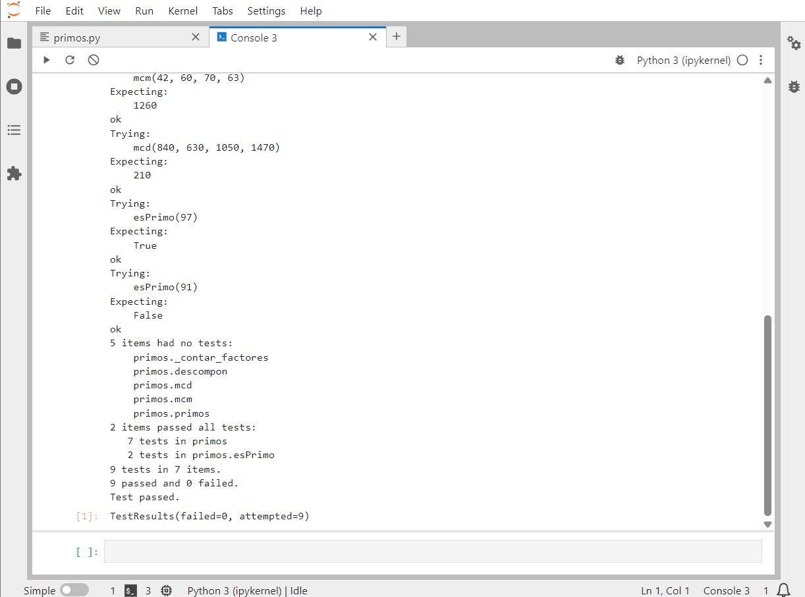

# práctica 2 APA: Martina Vermiglio Mas

## ejecución de los tests unitarios: 







## código desarrollado en primos.py 
```python
"""
primos.py: módulo de gestión de números primos
programa hecho por Martina Vermiglio Mas

Tests unitarios globales:
>>> [numero for numero in range(2, 50) if esPrimo(numero)]
[2, 3, 5, 7, 11, 13, 17, 19, 23, 29, 31, 37, 41, 43, 47]

>>> primos(50)
(2, 3, 5, 7, 11, 13, 17, 19, 23, 29, 31, 37, 41, 43, 47)

>>> descompon(36 * 175 * 143)
(2, 2, 3, 3, 5, 5, 7, 11, 13)

>>> mcm(90, 14)
630

>>> mcd(924, 780)
12

>>> mcm(42, 60, 70, 63)
1260

>>> mcd(840, 630, 1050, 1470)
210
"""

def esPrimo(numero):
    """
    Devuelve True si su argumento es primo, y False si no lo es.
    
    >>> esPrimo(97)
    True
    >>> esPrimo(91)
    False
    """
    if not isinstance(numero, int) or numero <= 1:
        raise TypeError("El argumento debe ser un número natural mayor que 1")
    
    for i in range(2, int(numero**0.5) + 1):
        if numero % i == 0:
            return False
    return True

def primos(numero):
    """Devuelve una tupla con todos los números primos menores que su argumento."""
    return tuple(n for n in range(2, numero) if esPrimo(n))

def descompon(numero):
    """Devuelve una tupla con la descomposición en factores primos de su argumento."""
    factores = []
    d = 2
    n = numero
    while n > 1:
        while n % d == 0:
            factores.append(d)
            n //= d
        d += 1
    return tuple(factores)

def _contar_factores(n):
    """Función auxiliar para obtener un diccionario de factor:exponente."""
    f = descompon(n)
    conteo = {}
    for factor in f:
        conteo[factor] = conteo.get(factor, 0) + 1
    return conteo

def mcm(*numeros):
    """Devuelve el mínimo común múltiplo de sus argumentos basados en factores primos."""
    # Se obtienen los diccionarios de factores de cada número
    diccionarios = [_contar_factores(n) for n in numeros]
    
    # Todos los factores primos que aparecen al menos una vez
    todos_factores = set()
    for d in diccionarios:
        todos_factores.update(d.keys())
        
    resultado = 1
    for f in todos_factores:
        # MCM: comunes y no comunes al mayor exponente
        max_exp = max(d.get(f, 0) for d in diccionarios)
        resultado *= (f ** max_exp)
    return resultado

def mcd(*numeros):
    """Devuelve el máximo común divisor de sus argumentos basados en factores primos."""
    diccionarios = [_contar_factores(n) for n in numeros]
    
    # Factores comunes (están en el primer número y en todos los demás)
    comunes = set(diccionarios[0].keys())
    for d in diccionarios[1:]:
        comunes &= set(d.keys())
        
    resultado = 1
    for f in comunes:
        # MCD: comunes al menor exponente
        min_exp = min(d.get(f, 0) for d in diccionarios)
        resultado *= (f ** min_exp)
    return resultado

if __name__ == "__main__":
    from doctest import testmod
    testmod(verbose=True)

