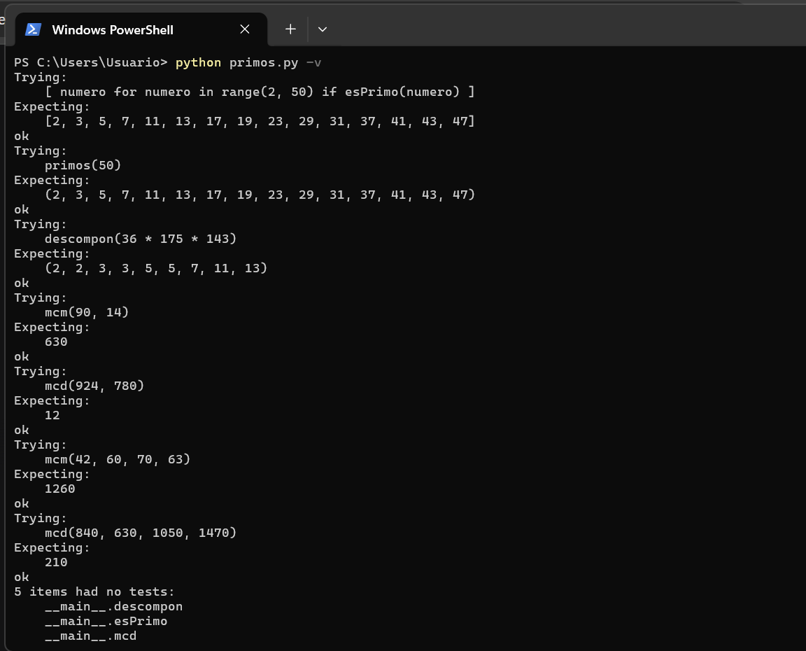
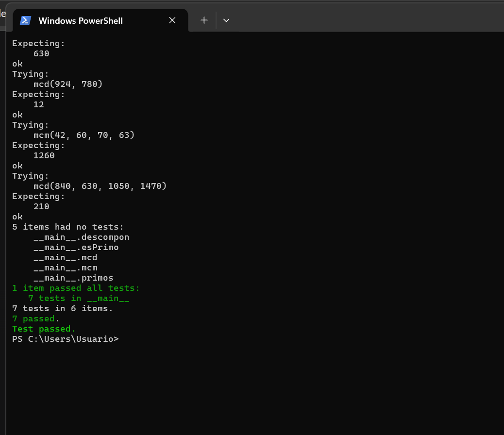

# APA-T2
**Estudiante:** Albert Blázquez Badenas

---

## Descripción del proyecto
Este repositorio contiene la implementación de funciones en Python para el manejo de números naturales, centrada en la identificación de números primos, descomposiciones factoriales y el cálculo de **Máximo Común Divisor (MCD)** y **Mínimo Común Múltiplo (mcm)** para un número arbitrario de argumentos.

---

## Ejecución de los tests unitarios
Para verificar el correcto funcionamiento de las funciones, se han incluido **doctests** en el docstring del fichero. A continuación, se muestra la captura de pantalla de la ejecución en modo verboso (`python primos.py -v`):




---

## Código Fuente (`primos.py`)

A continuación se adjunta el código desarrollado con el realce sintáctico correspondiente:

```python
"""
Manejo de números primos
Alumno: Albert Blázquez Badenas

Tests unitarios:
>>> [ numero for numero in range(2, 50) if esPrimo(numero) ]
[2, 3, 5, 7, 11, 13, 17, 19, 23, 29, 31, 37, 41, 43, 47]

>>> primos(50)
(2, 3, 5, 7, 11, 13, 17, 19, 23, 29, 31, 37, 41, 43, 47)

>>> descompon(36 * 175 * 143)
(2, 2, 3, 3, 5, 5, 7, 11, 13)

>>> mcm(90, 14)
630

>>> mcd(924, 780)
12

>>> mcm(42, 60, 70, 63)
1260

>>> mcd(840, 630, 1050, 1470)
210
"""

def esPrimo(numero):
    if not isinstance(numero, int) or numero <= 1:
        raise TypeError("El argumento debe ser un número natural mayor que 1.")
    for i in range(2, int(numero**0.5) + 1):
        if numero % i == 0:
            return False
    return True

def primos(numero):
    return tuple(n for n in range(2, numero) if esPrimo(n))

def descompon(numero):
    factores = []
    d = 2
    n = numero
    while n > 1:
        if n % d == 0:
            factores.append(d)
            n //= d
        else:
            d += 1
    return tuple(factores)

def mcd(*numeros):
    if not numeros: return None
    descs = [descompon(n) for n in numeros]
    comunes = set(descs[0])
    for d in descs[1:]:
        comunes &= set(d)
    res = 1
    for f in comunes:
        res *= (f ** min(d.count(f) for d in descs))
    return res

def mcm(*numeros):
    if not numeros: return None
    descs = [descompon(n) for n in numeros]
    todos = set()
    for d in descs:
        todos.update(d)
    res = 1
    for f in todos:
        res *= (f ** max(d.count(f) for d in descs))
    return res

if __name__ == "__main__":
    import doctest
    doctest.testmod(verbose=True)
