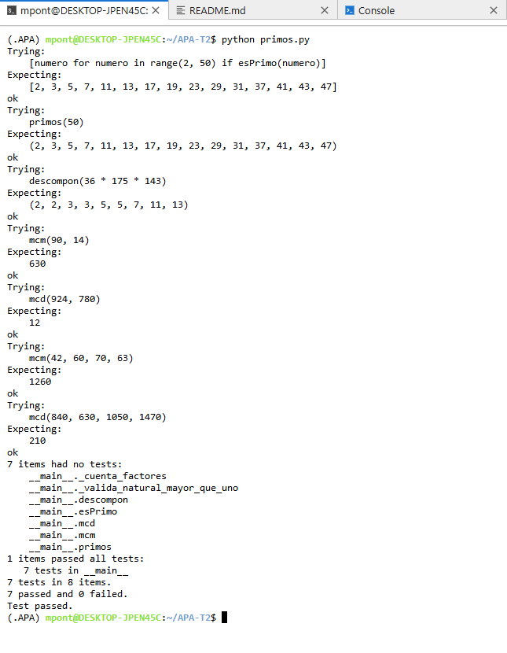

# Segunda tarea de APA 2026: Manejo de números primos

**Nombre y apellidos:** Pau Pont Camp

## Ejecución de los tests unitarios

A continuación se muestra una captura de pantalla con la ejecución en modo verboso de los tests unitarios:



## Código desarrollado

A continuación se incluye el contenido completo del fichero `primos.py`:

```python
import doctest
import math


def _valida_natural_mayor_que_uno(numero):
    """Validar que el argumento sea un entero natural mayor que uno."""
    if not isinstance(numero, int) or isinstance(numero, bool) or numero <= 1:
        raise TypeError("El argumento debe ser un número natural mayor que uno.")
    return numero


def esPrimo(numero):
    """Indicar si un número natural mayor que uno es primo."""
    _valida_natural_mayor_que_uno(numero)

    if numero == 2:
        return True
    if numero % 2 == 0:
        return False

    limite = math.isqrt(numero)
    for divisor in range(3, limite + 1, 2):
        if numero % divisor == 0:
            return False
    return True


def primos(numero):
    """Obtener todos los números primos menores que un valor dado."""
    _valida_natural_mayor_que_uno(numero)
    return tuple(n for n in range(2, numero) if esPrimo(n))


def descompon(numero):
    """Descomponer un número en sus factores primos."""
    _valida_natural_mayor_que_uno(numero)

    factores = []
    resto = numero
    divisor = 2

    while divisor * divisor <= resto:
        while resto % divisor == 0:
            factores.append(divisor)
            resto //= divisor
        divisor = 3 if divisor == 2 else divisor + 2

    if resto > 1:
        factores.append(resto)

    return tuple(factores)


def _cuenta_factores(numero):
    """Cuenta cuántas veces aparece cada factor primo."""
    factores = descompon(numero)
    conteo = {}

    for f in factores:
        if f in conteo:
            conteo[f] += 1
        else:
            conteo[f] = 1

    return conteo


def mcm(*numeros):
    """Calcular el mínimo común múltiplo de varios números."""
    if not numeros:
        raise TypeError("Debe indicarse al menos un número.")

    maximos = {}

    for numero in numeros:
        factores = _cuenta_factores(numero)

        for primo in factores:
            if primo not in maximos or factores[primo] > maximos[primo]:
                maximos[primo] = factores[primo]

    resultado = 1

    for primo in maximos:
        resultado *= primo ** maximos[primo]

    return resultado


def mcd(*numeros):
    """Calcular el máximo común divisor de varios números."""
    if not numeros:
        raise TypeError("Debe indicarse al menos un número.")

    lista_factores = [_cuenta_factores(n) for n in numeros]

    comunes = set(lista_factores[0].keys())

    for factores in lista_factores[1:]:
        comunes = comunes & set(factores.keys())

    resultado = 1

    for primo in comunes:
        minimo = min(f[primo] for f in lista_factores)
        resultado *= primo ** minimo

    return resultado


if __name__ == "__main__":
    doctest.testmod(verbose=True)
    
```
