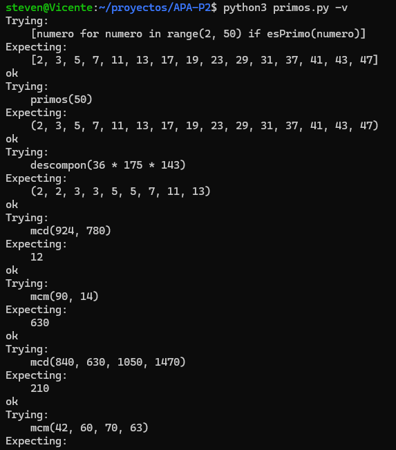
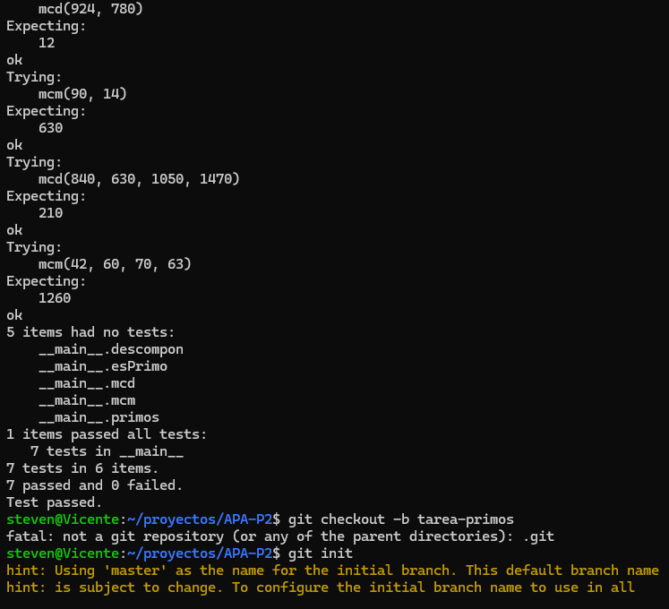

# Segunda tarea de APA 2026: Manejo de números primos

> [!Caution]
>
> El objetivo de esta tarea es manejar los tipos de datos y las estructuras de control de flujo de
> Python. Existen bibliotecas que resuelven los apartados del enunciado de una manera más eficiente
> y, sin duda, más sencilla, pero su uso está prohibido.
>
> Además, se valorará también el uso de Markdown en la redacción del fichero README.md; en concreto,
> la inclusión de código fuente con las herramientas propias de Markdown para su realce sintáctico, y
> la inclusión de imágenes con las capturas de pantalla solicitadas. El fichero README.md deberá ser
> visualizado correctamente desde la página principal del repositorio GitHub del alumno sin ninguna
> intervención por parte del profesor.
>
> Dispone del fichero MARKDOWN.md con información básica para el uso de Markdown, así como con enlaces
> a la documentación oficial del mismo.
>
> ¿Quiere saber más?, consulte con el profesorado.
  
## Nom i cognoms

> [!Important]
> Introduzca a continuación su nombre y apellidos:
>
> **Steven Daniel Vizcaino Cedeño**

---

## Entrega

### Ejecución de los tests unitarios

A continuación se presentan las capturas de pantalla que muestran el resultado exitoso de ejecutar el fichero `primos.py` con la opción `verbosa` (`-v`), demostrando que todas las funciones (`esPrimo`, `primos`, `descompon`, `mcd`, y `mcm`) pasan los tests unitarios solicitados.

**Parte 1 de los tests:**



**Parte 2 de los tests:**




### Código desarrollado (`primos.py`)

A continuación, se adjunta el código fuente completo del fichero `primos.py`. El código ha sido desarrollado respetando las normas de estilo PEP-8, incluyendo cadenas de documentación (docstrings) detalladas para cada función y sin utilizar bibliotecas externas.

```python
# ==============================================================================
# Tarea APA 2026: Manejo de números primos
# Alumno: Steven Daniel Vizcaino Cedeño
# ==============================================================================

def esPrimo(numero):
    """
    Devuelve True si el argumento es primo, y False si no lo es.
    Se debe considerar que numero es un número natural y mayor que uno.
    En caso contrario, la función debe elevar la excepción TypeError.
    """
    if not isinstance(numero, int) or numero <= 1:
        raise TypeError("El argumento debe ser un número natural mayor que 1")
    
    # Comprobar divisibilidad hasta la raíz cuadrada del número
    for i in range(2, int(numero**0.5) + 1):
        if numero % i == 0:
            return False
    return True

def primos(numero):
    """
    Devuelve una tupla con todos los números primos menores que su argumento.
    """
    return tuple(n for n in range(2, numero) if esPrimo(n))

def descompon(numero):
    """
    Devuelve una tupla con la descomposición en factores primos de su argumento.
    """
    factores = []
    d = 2
    temp = numero
    while temp > 1:
        while temp % d == 0:
            factores.append(d)
            temp //= d
        d += 1
    return tuple(factores)

def mcd(*numeros):
    """
    Calcula el MCD de un número arbitrario de argumentos partiendo de su 
    descomposición en factores primos.
    """
    if not numeros: return None
    
    # Obtenemos los factores del primer número como base
    comunes = list(descompon(numeros[0]))
    
    for num in numeros[1:]:
        factores_num = list(descompon(num))
        nueva_lista_comunes = []
        # Solo nos quedamos con los factores que estén en AMBOS
        for f in comunes:
            if f in factores_num:
                nueva_lista_comunes.append(f)
                factores_num.remove(f) # Evitamos repetir el mismo factor
        comunes = nueva_lista_comunes
        
    # Multiplicamos los factores comunes para obtener el MCD
    resultado = 1
    for f in comunes:
        resultado *= f
    return resultado

def mcm(*numeros):
    """
    Calcula el MCM de un número arbitrario de argumentos partiendo de su
    descomposición en factores primos.
    """
    if not numeros: return None
    
    todos_los_factores = {} # Diccionario para guardar el máximo exponente de cada factor
    
    for num in numeros:
        factores = descompon(num)
        # Contamos cuántas veces sale cada factor en este número
        conteo = {}
        for f in factores:
            conteo[f] = conteo.get(f, 0) + 1
        
        # Actualizamos el máximo exponente visto hasta ahora para cada primo
        for f, cantidad in conteo.items():
            if f not in todos_los_factores or cantidad > todos_los_factores[f]:
                todos_los_factores[f] = cantidad
                
    # Multiplicamos cada factor por su máximo exponente
    resultado = 1
    for f, exponente in todos_los_factores.items():
        resultado *= (f ** exponente)
    return resultado

if __name__ == "__main__":
    import doctest
    # Ejecuta los tests unitarios incluidos en los docstrings de este archivo.
    # El profesor debe ejecutar: python3 primos.py -v
    doctest.testmod()
